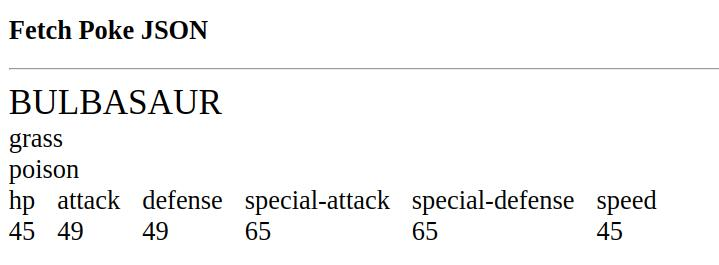

# Tarea

Para esta tarea tenemos como objetivo leer los datos de "bulbasaur.json" con fetch e interpretarlos y procesarlos para mostrar sus atributos en el HTML.

## Fetch
Utilice el archivo "bulbasaour.json" para realizar la tarea. Su objetivo es leer e intepretar los datos dentro de ese JSON.

## Mostrar resultados
Utilice lo que ya conoce y sabe de manipulación del DOM para mostrar los datos del pokemon en el HTML. Puede realizarlo de la manera que le parezca más conveniente, ejemplo:

- Utilizando ```<div>``` y ```<span>```.
- Utilizando ```<table>```.
- Utilizando ```<ul>``` y ```<li>```.

Ejemplo de un resultado posible de referencia:


