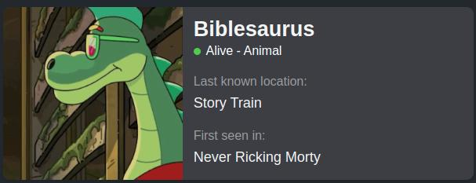

# Tarea

## 1 - Enunciado

- Debera capturar el evento "onclick" del boton "Consultar"
y leer los datos ingresados en "personaje".
- Tome esos datos y dentro del evento consulte los datos del
  personaje con la API mediante fetch.
- Ejemplo de la URL con la variable personaje:
- * `https://rickandmortyapi.com/api/character/?name=${personaje}`
- Capture los datos del personaje en un JSON e imprimalos en consola.

## 2 - Enunciado

- Capture la información del personaje y preséntela en el HTML, puede
  presentar la información como los ejemplos que se muestran en la página
  de la API:

- Puede agregar o no estilos al HTML, o presentar la información de forma cruda (queda a su criterio y creatividad).

##### Éxitos!

