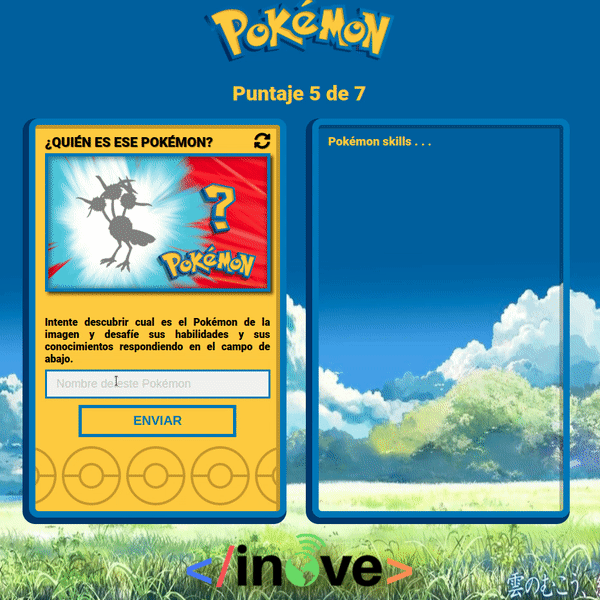

# Tarea

Para esta tarea tenemos como objetivo construir la aplicación de PokeTrivia. La aplicaciñon se irá construyendo a medida que avanzan las clases. A partir de ahora le pediremos siempre trabaje sobre el mismo repositorio donde vaya trabajando en esta aplicación (el repositorio creado a partir de la clase 7).

Cambios y mejoras incorporadas en este release:
- Agregar el archivo "api.js" en donde se coloca toda la lógica respecto a la API de pokemon y la información que se muestra del mismo.

## Desarrollo que debe realizar
#### En archivo events.js
- Cuando se adivine correctamente el pokemon se debe llamar a la función "buscarPokemon" pasando el número de pokemon adivinado (recuerde sumar +1 al "numero" de pokemon). Esta función la debe crear dentro de api.js.

#### En archivo api.js
- La función buscarPokemon debe realizar el fetch de `https://pokeapi.co/api/v2/pokemon/${numero}`. Los datos que debe capturar son:
- * El nombre
- * El nº de pokemon
- * El tipo/s de pokemon
- * Los atributos (HP, ATK, etc) y la cantidad de cada uno.
- Variables creadas para modificar la tarjeta de información de pokemon:
- * const pokeCard = document.querySelector('#data-poke-card');
- * const pokeName = document.querySelector('#data-poke-name');
- * const pokeId = document.querySelector('#data-poke-id');
- * const pokeTypes = document.querySelector('#data-poke-types');
- * const pokeStats = document.querySelector('#data-poke-stats');
- Deberá agregar un "div" a "pokeTypes" por cada tipo del pokemon.
- Deberá agregar un "div" a "pokeStats" por cada atributo del pokemon. Cada atributo debe estar compuesto por dos "divs" para el nombre del atributo (name) y su valor (amount).

Puede apoyarse en el ejemplo visto en clase para lograr capturar y mostrar todos los datos solicitados. Recuerde agregar los estilos necesarios y estructura para acercarse a lo que se ve en el gif final.

## Como se deberá ver su aplicación hasta el momento

#### ¡Ante cualquier duda no dude en contactar al profesor o tutor!.